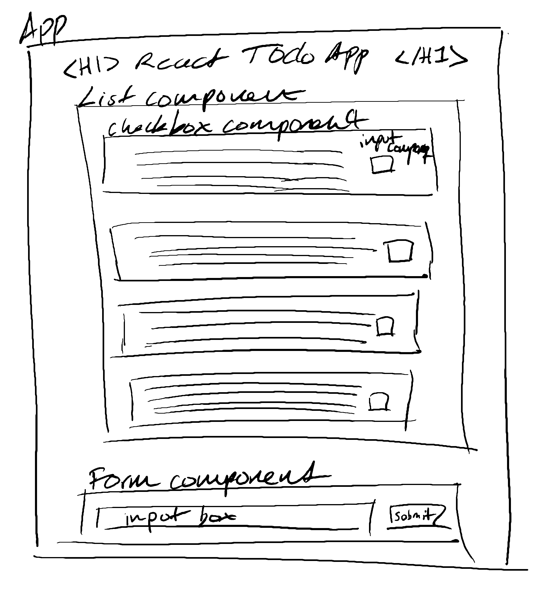

# Planning a React To-Do List

## Mockup

## App Structure

    <App>
        <h1>Todo App</h1>
        <TodoList />
        <TodoForm />
    </App>

## Components

### Todo List Components & Structure

    <TodoList>
        <TodoItem />
        <TodoItem />
        <TodoItem />
        <TodoItem />
    </TodoList>

    <TodoItem>
        
<CheckboxInput>
    </TodoItem>

- Todo list component
  - Individual todo items
    - Used within the todo list component to populate the todo items
  - Checkbox input component
    - Used within the todo item component to control states of the todo item

### Input Form Components & Structure

    <App>
        <h1>Todo App</h1>
        <TodoList />
        <TodoForm />
    </App>

    <TodoForm>
        <inputText><Submit>
    </TodoForm>

- Input form component
  - Text input
    - Used within the form component
    - Will need states to control input
  - Submit button
    - Used within the form component

## States

### Overall App State

If the app has a login function, will need a "logged out" and "logged in" state.

### Todo List States

Will need a "empty list" state vs the "has todo items" state. The checkbox component will also need to track the state of each todo item as complete or incomplete via props and have that as accessible data outside of the checkbox component.

### Input Form States

Needs to track the text input value as a state and reset the input box to be empty when the user submits the form to enter the new todo item.
