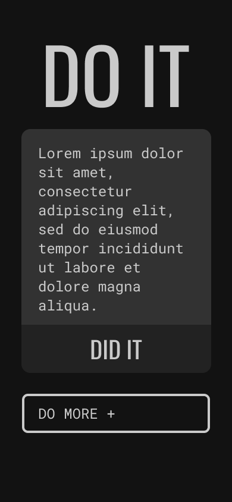
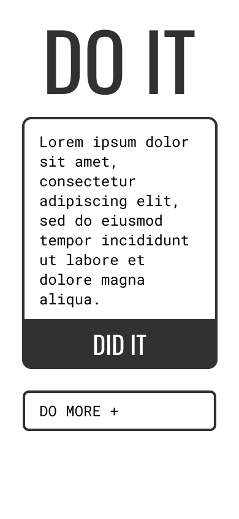

# Project 1, Milestone 1 - Proposal

## Proposal

Create a to-do list with persistent to-do items. Mostly inspired by other online to-do apps like Google Keep. Intended audience is anyone who uses an online app to keep track of things they need to do. All function will be run through JS/TypeScript.

New technologies to learn for this project:

- Google Firebase
- TypeScript

### MVP Functions

- Persistent to-do list that saves data to Firebase
- Responsive design
- Complete visuals according to proposed wireframes

### Stretch Goals

- Use Firebase to include user authentication
- Smooth out user experience using animations
- Light/dark mode
- On either task completion or list completion, shoot a confetti cannon on the screen - this is entirely to annoy my roommate

---

## Wireframes

### Mobile

    

    

### Desktop

