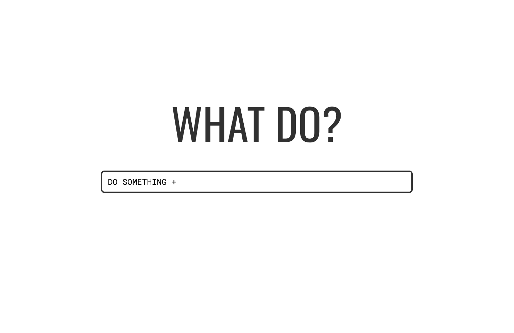
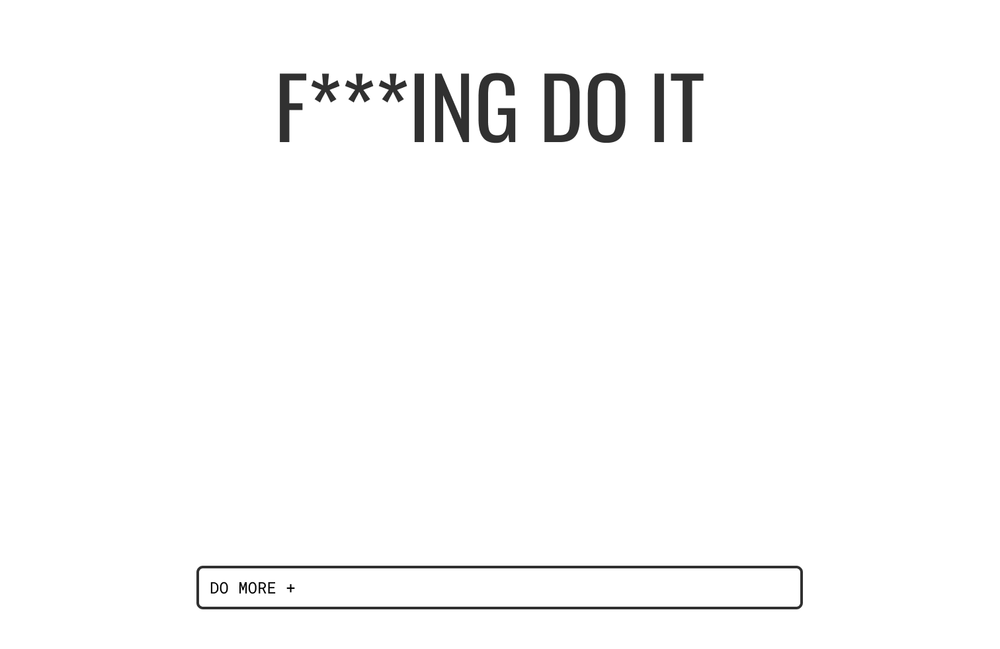
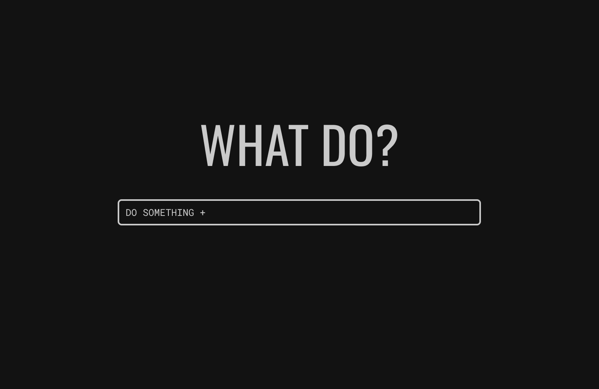
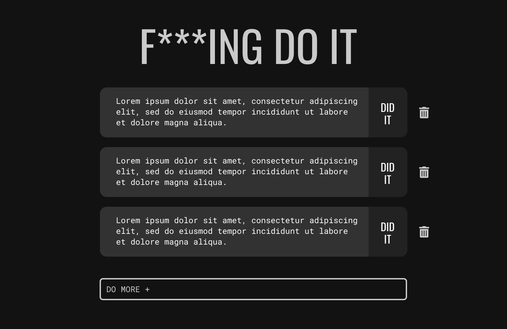
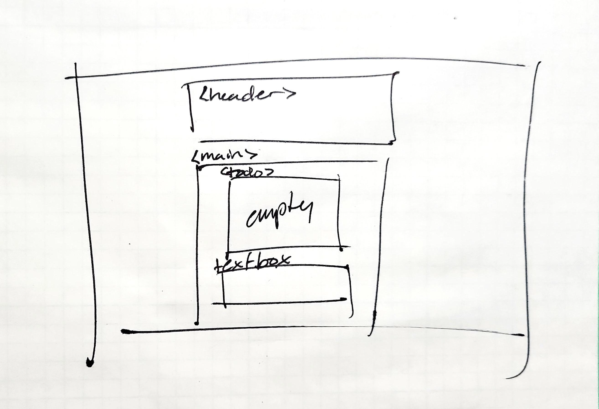
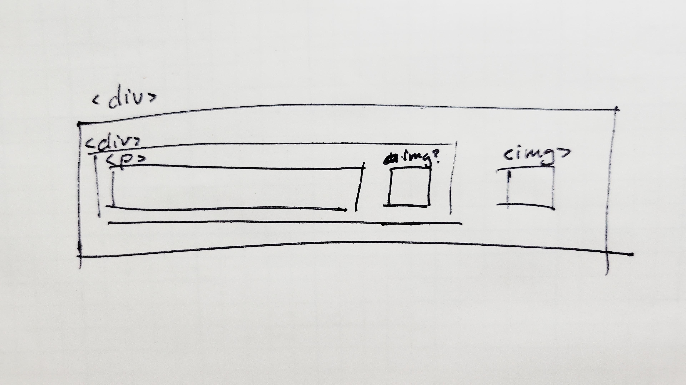

# Project 1, Milestone 2 - WIP Check-in

[PREVIOUS MILESTONE](milestone1.md)
[NEXT MILESTONE](milestone3.md)

[LIVE DEMO](https://atls4630-fwd.vercel.app/projects/project1/index.html)

## Project Brief

Create a to-do list with persistent to-do items. Mostly inspired by other online to-do apps like Google Keep. Intended audience is anyone who uses an online app to keep track of things they need to do. All function will be run through JS/TypeScript.

### MVP Functions

- Persistent to-do list that saves data to Firebase
- Responsive design
- Complete visuals according to proposed wireframes

## Milestone 2 Goals

Complete the HTML and CSS code. App landing page will be visible, but there is no function yet.

- [x] Finalize design
- [x] Plan out HTML
- [x] Finish basic styling
- [x] Plan for TS/JS and Firebase integration

---

## Final Design

I realized as I got started, I had forgotten to plan out what the page would look like with no to-do items - the initial appearance of the to-do app. Therefore, I whipped one up to match the irreverent style of the whole project.

### Light

### Dark

While the full light/dark swap feature is still a stretch feature, it's always good for me to know what I'm aiming for.

Actually, as I write this, I realize I've also forgotten to plan what the to-do items will look like after they've been completed. I have decided to cross that bridge when I get to it.

## HTML Planning Wireframes

As always, I start coding by drawing out the general box model for my page. Taking into account the malleable nature of the to-do section of the page, I have tried to keep the layout as simple as possible.

For the to-do list items, a div template should work the best to make updating content easy.

Everything will be made with flexboxes and responsive units.

## TS/JS Planning

The functions that I will need to write are:

- When something is entered in the text box, create a new to-do list item and add it to the "todo" div.
- If there are to-do list items, change the header text.
- When the trash icon is clicked, delete the to-do item associated with that trash icon.

I think the best way to go about learning the things I need to learn is to add only one new thing at a time:

1) Start writing in TypeScript.
2) Get a basic to-do list working with nodes/objects.
3) Connect Firebase to the to-do list.

As long as I break the project down into smaller bits, it is less likely to overwhelm me. But I should also take the time to acknowledge that it's a large project for me to take on.

I am optimistic that I can get what I've planned done. But if I have to reduce the number of features, it won't be the end of the world.

## Research Resources

- [TypeScript node documentation](https://github.com/cnakpil/atls4630-fwd/blob/main/documentation/project1/milestone2.md)
- [Firebase to-do list example](https://dev.to/lada496/to-do-list-with-firebase-web-ver9-hd8)
- [JS to-do list w/ nodes](https://codepen.io/franklynroth/pen/ZYeaBd)