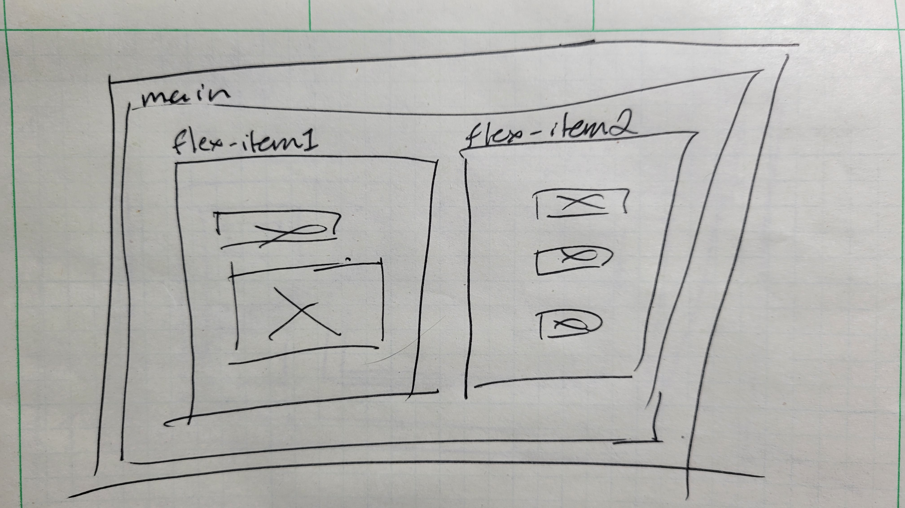
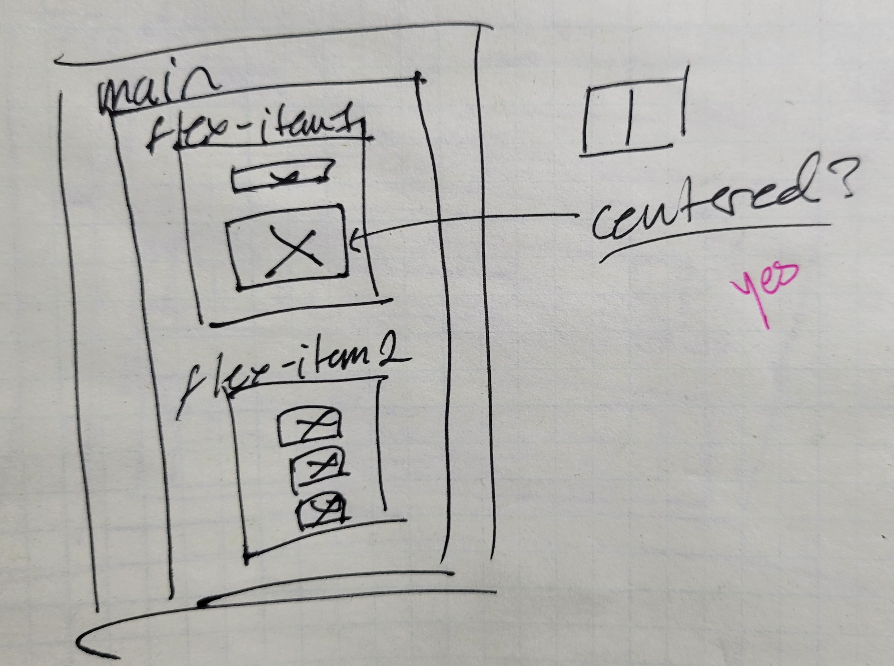
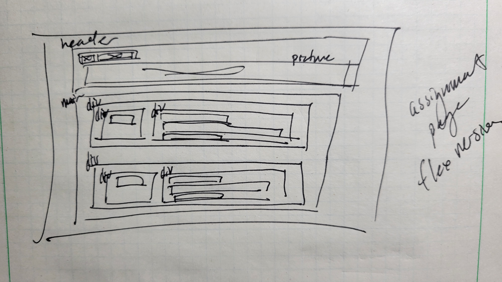
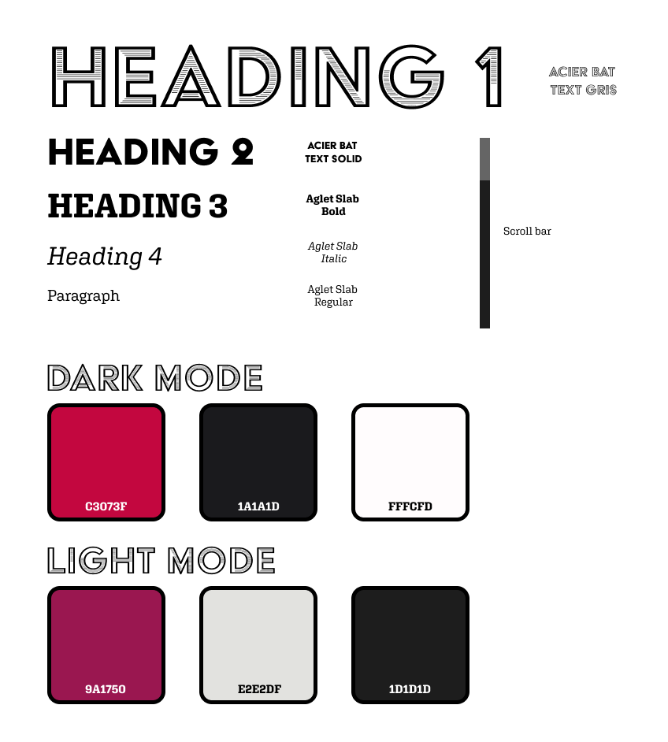
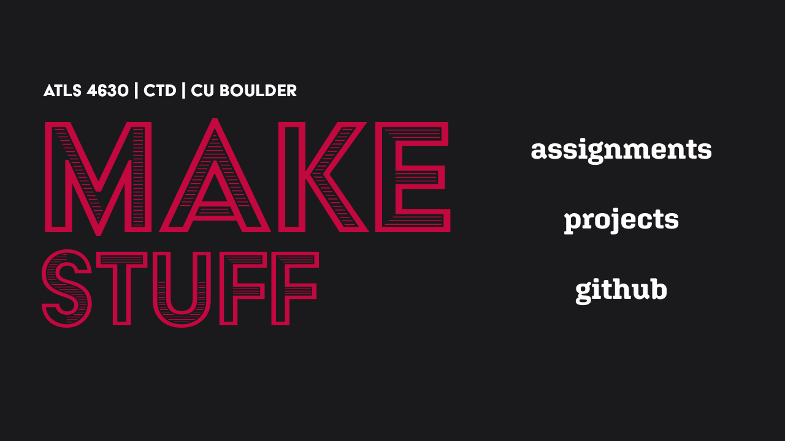
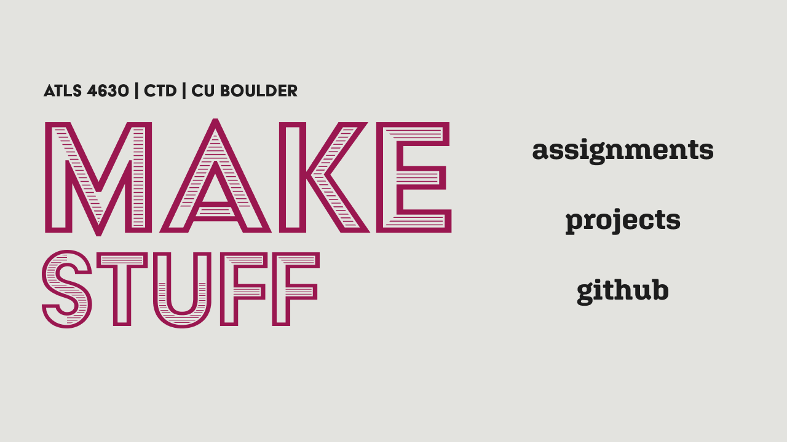

# Class Portal, Milestone 2

## [Link to Part 1](../week1/week1.md)

## [Link to Class Portal](https://atls4630-fwd.vercel.app/)

### Assignment Goal

Design and develop a class portal that will consolidate all class assignments, projects, and documentation in one place. The portal should be a good representation of my current  design and web development skills in vanilla HTML, CSS, and JS.

### Milestone 2

- [x] Multiple HTML pages linked together in a logical manner
- [x] Pages styled with CSS, linked externally
- [x] Responsive/mobile first design
- [x] Clear organization between assignments and projects
- [x] Links to the process journal for each assignment/project

### Stretch Goals

- [x] Animations on link hover
- [ ] Implement light/dark mode
- [ ] Improve responsiveness with JS (swap to centered justification, swapping img headers to suit smaller screen sizes)
- [ ] Add media queries to remove hover effects on mobile devices
- [ ] Add "Back to Top" link on Assignment/Project pages

---

## Coding

I wanted to use fewer specific element ID's to style my CSS and more classes and inheritance. I'm still unsure as to the industry standard class/id conventions, but it seemed wise to practice something that I'm unfamiliar with.

Additionally, flexboxes aren't something that I'd call my strength. Thus, I challenged myself to build the entire layout of my site using only flexboxes. Prior to this, I'd always used CSS grids which, while easier for me to conceptulize, required a significant amount of work to make responsive.

### Low Fidelity Wireframes

To pull off my flexbox commitment, I returned back to making some lower fidelity wireframes to help me plan the html code structure for my various layouts and pages. Planning out the code by hand before I began allowed me to do the code equivalent of "measure twice, cut once". 

    
    
    

## Color Palette - Light/Dark Mode

As I began to code out my layouts, I rethought the color schema that I'd planned during the design phase, opting for a color palette that better lent itself to a light/dark mode for accesibility purposes. Having fun with design and colors is best when it serves both the viewer and creator.

I'll need to keep that in mind for my next designs.

    
    
    

After making the visual updates, the layouts come together easier than I expected them to. I spent a lot of time with the [CSS-Tricks Flexbox Guide](https://css-tricks.com/snippets/css/a-guide-to-flexbox/) and the [Mozilla Documentation](https://developer.mozilla.org/en-US/docs/Learn/CSS/CSS_layout/Flexbox) to get everything approximately where they needed to be.

I still believe that there is a time and place for CSS grids - namely, complex mosaics of differently sized objects on a page. But I suspect that for  99% of the websites I make that need a layout-like framework,  I will be able to create them with flexboxs and the occasional media query/js to swap certain elements into place.

---

## Stretch Goals

This section will be updated as I implement the extraneous features that I have planned.

### Link Animations

One of my biggest dilemmas is how to tell viewers that something is a link (and therefore clickable) without having the symbolic link underline.

[This CSS Tricks tutorial to several hover effects](https://css-tricks.com/css-link-hover-effects/) and [the Nielsen Norman Group's Guidelines for Visualizing Links](https://www.nngroup.com/articles/guidelines-for-visualizing-links/) provided me an excellent starting point as to how one might make a link interactable without breaking aesthetic.

